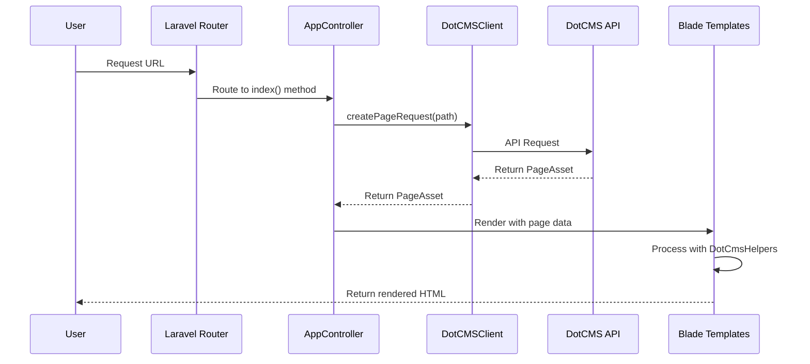

# DotCMS Laravel Integration

This project demonstrates how to build a DotCMS webapp with Laravel using the DotCMS PHP SDK. It provides a complete example of rendering DotCMS pages within a Laravel application, including layouts, containers, and content types.

## Overview

This integration allows you to:

- Fetch and render DotCMS pages in a Laravel application
- Integrate Laravel routing with DotCMS, enabling content authors to create new pages without developer intervention
- Render DotCMS Pages using Blade templates, including layouts, containers and contentlets
- Integrate DotCMS SDK feedback into Laravel's exception handling for a smooth developer experience

## Prerequisites

- PHP 8.2 or higher
- [Composer](https://getcomposer.org/doc/00-intro.md)
- [Laravel CLI](https://laravel.com/docs/10.x/installation)
- DotCMS instance with [API access](https://dev.dotcms.com/docs/rest-api-authentication)

## Project Structure

```
dotcms-laravel/
├── app/
│   ├── Http/
│   │   └── Controllers/
│   │       └── AppController.php  # Handles all DotCMS page requests
│   ├── Providers/
│   │   ├── AppServiceProvider.php
│   │   └── DotCMSServiceProvider.php  # Registers DotCMS services
│   └── Helpers/
│       └── DotCmsHelpers.php      # Helper functions for DotCMS rendering
├── resources/
│   ├── css/
│   │   └── app.css                # Styles including grid system
│   ├── js/
│   └── views/
│       ├── layouts/
│       │   ├── app.blade.php      # Base layout
│       │   ├── header.blade.php   # Header component
│       │   └── container.blade.php # Container template
│       ├── dotcms/
│       │   ├── components/
│       │   │   └── navigation.blade.php  # Navigation component
│       │   └── content-types/     # Content type templates
│       │       ├── activity.blade.php
│       │       ├── banner.blade.php
│       │       └── product.blade.php
│       └── page.blade.php         # Main page template
└── routes/
    └── web.php                    # Route definitions including catch-all route
```

## Installation

1. Clone this repository or create a new Laravel project:

```bash
composer create-project laravel/laravel my-dotcms-project
cd my-dotcms-project
```

This command creates a fresh Laravel installation, which serves as the foundation for your DotCMS-integrated application.

2. Install the DotCMS PHP SDK:

```bash
composer require dotcms/php-sdk
```

This adds the official DotCMS PHP SDK to your project, providing the necessary methods to interact with DotCMS APIs.

3. Configure your DotCMS connection in `.env`:

```
DOTCMS_HOST=https://demo.dotcms.com
DOTCMS_API_TOKEN=your-api-key-here
```

These environment variables define the connection to your DotCMS instance, allowing the SDK to authenticate and make API calls.

### Using Local SDK Development Setup

If you want to test the Laravel example with a local version of the PHP SDK (for development or testing new changes), you can use the `composer.dev.json` configuration:

1. First, ensure you're in the Laravel example directory:
```bash
cd examples/dotcms-laravel
```

2. If you have previously run `composer install`, remove the vendor directory:
```bash
rm -rf vendor
```

3. Install dependencies using the development configuration:
```bash
COMPOSER=composer.dev.json composer install
```

This will use the local SDK from the parent directory instead of the published package version.

## Configuration

All the configuration described below is already implemented in this example project. The following sections explain the key components and how they work together to integrate DotCMS with Laravel.

### 1. Configure DotCMS Client

Create a service provider to register the DotCMS client in `app/Providers/DotCMSServiceProvider.php`:

```php
<?php

namespace App\Providers;

use Illuminate\Support\ServiceProvider;
use Dotcms\PhpSdk\Config\Config;
use Dotcms\PhpSdk\DotCMSClient;

class DotCMSServiceProvider extends ServiceProvider
{
    /**
     * Register services.
     */
    public function register(): void
    {
        $this->app->singleton(DotCMSClient::class, function ($app) {
            $config = new Config(
                host: env('DOTCMS_HOST', 'https://demo.dotcms.com'),
                apiKey: env('DOTCMS_API_TOKEN', '')
            );
            
            return new DotCMSClient($config);
        });
    }

    /**
     * Bootstrap services.
     */
    public function boot(): void
    {
        //
    }
}
```

This service provider:
- Creates a singleton instance of the DotCMS client to ensure consistent state across the application
- Configures the client with your DotCMS host and API token from environment variables
- Makes the client available for dependency injection throughout your app

Register the service provider in `app/Providers/AppServiceProvider.php`:

```php
$this->app->register(DotCMSServiceProvider::class);
```

And in `bootstrap/providers.php`:

```php
App\Providers\DotCMSServiceProvider::class,
```

These registrations ensure the DotCMS service provider is loaded during application bootstrap.

### 2. Create Helper Functions

Create helper functions for DotCMS rendering in `app/Helpers/DotCmsHelpers.php`. This implementation leverages the helper utilities provided by the PHP SDK:

```php
<?php

namespace App\Helpers;

use Dotcms\PhpSdk\Utils\DotCmsHelper;
use Dotcms\PhpSdk\Model\Content\Contentlet;

class DotCmsHelpers
{
    /**
     * Generate HTML attributes from an associative array
     * 
     * @param array $attributes
     * @return string
     */
    public function htmlAttr($attributes)
    {
        return DotCmsHelper::htmlAttributes($attributes);
    }

    /**
     * Generate HTML based on contentlet properties
     * 
     * @param Contentlet $content
     * @return string
     */
    public function generateHtmlBasedOnProperty(Contentlet $content)
    {
        if (empty($content)) {
            return '';
        }

        // Check if we have a template to render
        $contentType = $content->contentType;
        if ($contentType) {
            $viewPath = 'dotcms.content-types.' . strtolower($contentType);
            if (view()->exists($viewPath)) {
                return view($viewPath, ['content' => $content])->render();
            }
        }

        // Fall back to the SDK simple HTML renderer
        return DotCmsHelper::simpleContentHtml($content->jsonSerialize());
    }
}
```

The DotCMSHelpers class provides two key functions, all leveraging the SDK's `DotCmsHelper` utility class:
- `htmlAttr`: Safely generates HTML attributes from arrays, handling special cases like boolean attributes
- `generateHtmlBasedOnProperty`: Renders content intelligently by looking for type-specific templates or falling back to the SDK's default renderer

Create a service provider to share the helpers with all views in `app/Providers/DotCmsHelpersServiceProvider.php`:

```php
<?php

namespace App\Providers;

use Illuminate\Support\ServiceProvider;
use Illuminate\Support\Facades\View;
use App\Helpers\DotCmsHelpers;

class DotCmsHelpersServiceProvider extends ServiceProvider
{
    /**
     * Register services.
     */
    public function register(): void
    {
        //
    }

    /**
     * Bootstrap services.
     */
    public function boot(): void
    {
        // Share the DotCmsHelpers with all views
        View::share('dotCmsHelpers', new DotCmsHelpers());
    }
}
```

This service provider makes the helper functions available in all Blade templates via the `$dotCmsHelpers` variable, ensuring a consistent interface for templating.

Register the helper service provider in `app/Providers/AppServiceProvider.php`:

```php
$this->app->register(DotCmsHelpersServiceProvider::class);
```

### 3. Configure Routes

In `routes/web.php`, add a catch-all route to handle DotCMS pages:

```php
// Catch-all route for rendering DotCMS pages
// This should only trigger for routes that might be DotCMS pages
// Static assets should be served directly from public directory
Route::fallback([AppController::class, 'index'])->where('fallbackPlaceholder', '^(?!.*\.(js|css|png|jpg|jpeg|gif|ico|svg|woff|woff2|ttf|eot)).*$');
```

This route configuration:
- Uses Laravel's fallback route to catch all URLs not explicitly defined in your routes file
- Includes a regex pattern to exclude static assets from being processed by DotCMS
- Routes all valid page requests to the AppController's index method

### 4. Create a Controller

Create a controller to handle DotCMS page requests in `app/Http/Controllers/AppController.php`:

```php
<?php

namespace App\Http\Controllers;

use Illuminate\Http\Request;
use Illuminate\Support\Facades\Log;
use Dotcms\PhpSdk\DotCMSClient;

class AppController extends Controller
{
    /**
     * The DotCMS client instance.
     */
    protected $dotCMSClient;
    
    /**
     * Create a new controller instance.
     */
    public function __construct(DotCMSClient $dotCMSClient)
    {
        $this->dotCMSClient = $dotCMSClient;
    }
    
    /**
     * Handle the SPA rendering with dotCMS page data
     *
     * @param  \Illuminate\Http\Request  $request
     * @return \Illuminate\View\View
     */
    public function index(Request $request)
    {
        try {
            // Get the current path from the request
            $path = $request->path();
            $path = $path === '/' ? '/' : '/' . $path;

            // Create a page request for the current path
            $pageRequest = $this->dotCMSClient->createPageRequest($path, 'json');
            
            // Get the page data
            $pageAsset = $this->dotCMSClient->getPage($pageRequest);
            
            // Create a navigation request with depth=2
            $navRequest = $this->dotCMSClient->createNavigationRequest('/', 2);
            
            // Get the navigation
            $nav = $this->dotCMSClient->getNavigation($navRequest);

            // Check for entity wrapper in the response
            if (isset($pageAsset->entity)) {
                // Some dotCMS versions return data in an 'entity' wrapper
                $page = $pageAsset;
            } else {
                // Standard structure already expected by our templates
                $page = $pageAsset;
            }

            // Pass the data to the view
            return view('page', [
                'pageAsset' => $page,
                'navigation' => $nav
            ]);
        } catch (\Exception $e) {
            // Log the error
            Log::error('dotCMS API Error: ' . $e->getMessage());
            
            // Rethrow the exception to let Laravel handle it
            throw $e;
        }
    }
}
```

The AppController:
- Receives the DotCMSClient through dependency injection
- Extracts the requested path from the URL
- Fetches both the requested page and site navigation from DotCMS
- Handles API response variations between DotCMS versions
- Passes the normalized data to the Blade templates for rendering
- Implements error handling with proper logging

### 5. Create Blade Templates

Create the necessary templates to render DotCMS content:

#### Main Layout (`resources/views/layouts/app.blade.php`):

```php
<!DOCTYPE html>
<html lang="{{ str_replace('_', '-', app()->getLocale()) }}">
    <head>
        <meta charset="UTF-8">
        <meta name="viewport" content="width=device-width, initial-scale=1.0">
        <title>@yield('title', 'DotCMS Laravel')</title>
        <link rel="icon" href="data:image/svg+xml,<svg xmlns=%22http://www.w3.org/2000/svg%22 viewBox=%220 0 128 128%22><text y=%221.2em%22 font-size=%2296%22>⚫️</text></svg>">
        
        @section('stylesheets')
            @vite(['resources/css/app.css', 'resources/js/app.js'])
        @show
    </head>
    <body>
        @include('layouts.header')
        @yield('content')
    </body>
</html>
```

This main layout:
- Provides the basic HTML structure for all pages
- Sets up meta tags, title, and favicon
- Loads CSS and JavaScript assets using Laravel Vite
- Includes a common header component
- Creates a content section for page-specific content

#### Main Page Template (`resources/views/page.blade.php`):

```php
@extends('layouts.app')

@section('title', isset($pageAsset->page->title) ? $pageAsset->page->title : 'DotCMS Laravel')

@section('content')
    {{-- Page Content --}}
    @if(isset($pageAsset->layout) && isset($pageAsset->layout->body) && isset($pageAsset->layout->body['rows']))
        @foreach($pageAsset->layout->body['rows'] as $row)
            <div class="container">
                <div data-dot-object="row" class="row{{ isset($row['styleClass']) ? ' ' . $row['styleClass'] : '' }}">
                    @if(isset($row['columns']) && !empty($row['columns']))
                        @foreach($row['columns'] as $column)
                            @php
                                $startClass = 'col-start-' . ($column['leftOffset'] ?? 0);
                                $endClass = 'col-end-' . (($column['width'] ?? 12) + ($column['leftOffset'] ?? 0));
                            @endphp
                            
                            <div data-dot-object="column" class="{{ $startClass }} {{ $endClass }}{{ isset($column['styleClass']) ? ' ' . $column['styleClass'] : '' }}">
                                @if(isset($column['containers']) && !empty($column['containers']))
                                    @foreach($column['containers'] as $container)
                                        @include('layouts.container', [
                                            'container' => $container,
                                            'containers' => $pageAsset->containers ?? []
                                        ])
                                    @endforeach
                                @endif
                            </div>
                        @endforeach
                    @endif
                </div>
            </div>
        @endforeach
    @else
        <div class="container">
            <div class="row">
                <div class="col-start-1 col-end-13">
                    <div class="alert alert-warning">
                        No layout found
                    </div>
                </div>
            </div>
        </div>
    @endif
@endsection
```

This page template:
- Extends the main layout and sets the page title from DotCMS data
- Recursively iterates through the DotCMS page structure (rows, columns, containers)
- Calculates grid classes for responsive layouts based on DotCMS column configurations
- Properly includes container templates with their associated data
- Provides a fallback message if no layout is found

#### Container Template (`resources/views/layouts/container.blade.php`):

```php
@php
$containerAttrs = [
    'data-dot-object' => 'container',
    'data-dot-identifier' => $container->identifier,
    'data-dot-accept-types' => $container->acceptTypes,
    'data-max-contentlets' => $container->maxContentlets,
    'data-dot-uuid' => $container->uuid
];
@endphp

<div {!! $dotCmsHelpers->htmlAttr($containerAttrs) !!}>
    @foreach($container->contentlets as $content)
        @php
        $contentAttrs = [
            'data-dot-object' => 'contentlet',
            'data-dot-identifier' => $content->identifier,
            'data-dot-basetype' => $content->baseType,
            'data-dot-title' => $content->widgetTitle ?? $content->title,
            'data-dot-inode' => $content->inode,
            'data-dot-type' => $content->contentType,
            'data-dot-container' => json_encode([
                'acceptTypes' => $container->acceptTypes,
                'identifier' => $container->identifier,
                'maxContentlets' => $container->maxContentlets,
                'variantId' => $container->variantId,
                'uuid' => $container->uuid
            ])
        ];
        @endphp
        
        <div {!! $dotCmsHelpers->htmlAttr($contentAttrs) !!}>
            {!! $dotCmsHelpers->generateHtmlBasedOnProperty($content) !!}
        </div>
    @endforeach
</div>
```

The container template:
- Sets up data attributes for DotCMS integration and edit-mode functionality
- Iterates through content items in the container
- Adds necessary metadata attributes to each content element
- Delegates rendering to the appropriate content type template

## Running the Application

1. Start the Laravel development server:

```bash
php artisan serve
```

This command starts Laravel's built-in development server on port 8000, providing a quick way to test your application.

2. Visit `http://localhost:8000` in your browser. The application will fetch and render pages from your DotCMS instance.

## Enable Universal Visual Editor (UVE)

To enable the Universal Visual Editor (UVE) for in-context editing:

1. Install the UVE package:

```bash
npm install @dotcms/uve
```

2. Update your `resources/js/app.js` to initialize UVE:

```javascript
import {createUVESubscription} from '@dotcms/uve';

import './bootstrap';

try {
    createUVESubscription('changes', (changes) => {
        window.location.reload();
    });
} catch (error) {
    console.warn('dotUVE is not available, you might experience issues with the the Universal Visual Editor', error);
}
```

This setup enables real-time updates when content is edited through the Universal Visual Editor.

## How It Works

1. When a user visits a URL, the catch-all route directs the request to `AppController::index()`.
2. The controller uses the `DotCMSClient` to fetch the page from DotCMS.
3. The page data is passed to the Blade templates for rendering.
4. DotCMS-specific helper functions assist with rendering containers and content.
5. Content-type specific templates render each content type appropriately.
6. The `createUVESubscription` is to subscribe to the pages changes that the user performs inside the UVE.



This sequence diagram illustrates the complete request flow from user browser through Laravel, DotCMS, and back to the browser as rendered HTML.

## UI Components

### Content Type Mapping Implementation

The mapping between content types and templates is implemented in the `generateHtmlBasedOnProperty` method in `app/Helpers/DotCmsHelpers.php`:

```php
public function generateHtmlBasedOnProperty($content)
{
    if (empty($content)) {
        return '';
    }

    // Check if we have a template to render
    $contentType = $content['contentType'] ?? '';
    if ($contentType) {
        $viewPath = 'dotcms.content-types.' . strtolower($contentType);
        if (view()->exists($viewPath)) {
            return view($viewPath, ['content' => $content])->render();
        }
    }

    // Default rendering with title
    $title = $content['title'] ?? $content['name'] ?? 'No Title';
    return '<div class="content-wrapper"><h3>' . htmlspecialchars($title, ENT_QUOTES, 'UTF-8') . '</h3></div>';
}
```

This method:
- Extracts the content type name from the DotCMS content object (`$content['contentType']`)
- Converts it to lowercase for consistent file naming
- Constructs a view path in the format `dotcms.content-types.[content-type-name]`
- Checks if the template exists using Laravel's `view()->exists()`
- If found, renders the template with the content data
- If not found, falls back to a simple default rendering with just the title

The method is called from the container template (`resources/views/layouts/container.blade.php`):

```php
<div {!! $dotCmsHelpers->htmlAttr($contentAttrs) !!}>
    {!! $dotCmsHelpers->generateHtmlBasedOnProperty($content) !!}
</div>
```

### Content Type to Template Mapping

Each DotCMS content type is mapped to a corresponding Blade template:

- **Activity content type** → `resources/views/dotcms/content-types/activity.blade.php`
  - Maps fields: image, title, description, detailUrl
  
- **Banner content type** → `resources/views/dotcms/content-types/banner.blade.php`
  - Maps fields: image, title, caption, callToActionLink, callToActionText
  
- **Product content type** → `resources/views/dotcms/content-types/product.blade.php`
  - Maps fields: image, title, retailPrice, salePrice

### Benefits of This Approach

- **Automatic template selection**: No need for switch/case statements or configuration files
- **Naming convention based**: Simple predictable mapping using lowercase content type names
- **Easy to extend**: Just add a new template file to support a new content type
- **Graceful fallback**: Content types without specific templates still render with basic styling
- **Separation of concerns**: Content structure (from DotCMS) is separate from presentation (Blade templates)

## Customization

### Adding New Content Types

To add support for a new content type:

1. Create a new template in `resources/views/dotcms/content-types/your-content-type.blade.php`
2. Ensure the `generateHtmlBasedOnProperty` method in `DotCmsHelpers.php` will find your template based on the content type name

### Styling

The project includes a basic grid system and utility classes in `resources/css/app.css`. It uses Tailwind CSS for styling components.

## Resources

- [DotCMS PHP SDK Documentation](https://github.com/dotcms/php-sdk)
- [Laravel Documentation](https://laravel.com/docs)
- [DotCMS REST API Documentation](https://dotcms.com/docs/latest/rest-api)

## License

This project is open-sourced software licensed under the [MIT license](https://opensource.org/licenses/MIT).
