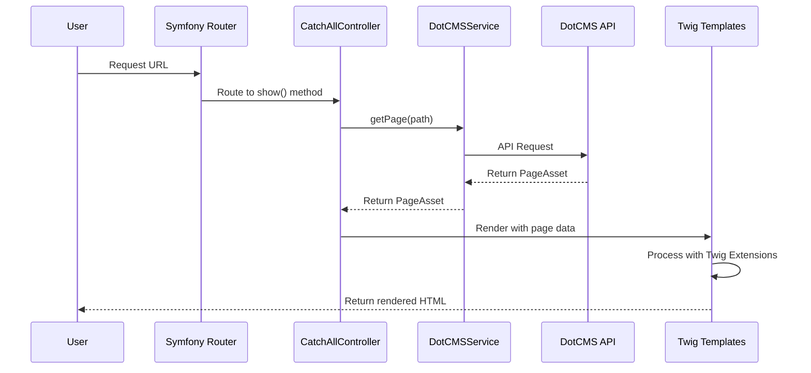

# DotCMS Symfony Integration

This project demonstrates how to build a DotCMS webapp with Symfony using the DotCMS PHP SDK. It provides a complete example of rendering DotCMS pages within a Symfony application, including layouts, containers, and content types.

## Overview

This integration allows you to:

- Fetch and render DotCMS pages in a Symfony application
- Integrate Symfony routing with DotCMS, enabeling content authors to create new pages without developer intervention.
- Render DotCMS Pages using Twig templates, this includes layouts, containers and contentlets.
- Integrating DotCMS SDK feedback into Symfony's exception framework for a smooth and reliable developer experience.

## Prerequisites

- PHP 8.1 or higher
- [Composer](https://getcomposer.org/doc/00-intro.md)
- [Symfony CLI](https://symfony.com/download)
- DotCMS instance with [API access](https://dev.dotcms.com/docs/rest-api-authentication)

## Project Structure

```
dotcms-symfony/
├── assets/                  # Frontend assets
│   └── styles/              # CSS files
├── config/                  # Symfony configuration
│   ├── routes.yaml          # Route definitions including catch-all route
│   └── services.yaml        # Service definitions including DotCMS client
├── src/
│   ├── Controller/
│   │   └── CatchAllController.php  # Handles all DotCMS page requests
│   ├── Service/
│   │   └── DotCMSService.php       # Wrapper for DotCMS PHP SDK
│   └── Twig/
│       └── DotCMSExtension.php     # Twig extensions for DotCMS rendering
└── templates/
    ├── base.html.twig              # Base template
    ├── page.html.twig              # Main page template
    └── dotcms/                     # DotCMS-specific templates
        ├── container.twig          # Container template
        ├── header.twig             # Header template
        └── content-types/          # Content type templates
            ├── banner.twig
            ├── product.twig
            └── activity.twig
```

## Using SDK Utilities

This example leverages the utility helpers provided by the DotCMS PHP SDK. The SDK includes a `DotCmsHelper` class with common functions for rendering and working with DotCMS content:

- `getContainerData()`: Retrieves container data by identifier
- `htmlAttributes()`: Generates HTML attributes from an associative array
- `simpleContentHtml()`: Provides fallback HTML rendering for content types

These utilities are used in the Twig extension (`DotCMSExtension.php`) to simplify templating:

```php
<?php

namespace App\Twig;

use Dotcms\PhpSdk\Utils\DotCmsHelper;
use Twig\Extension\AbstractExtension;
use Twig\TwigFunction;

class DotCMSExtension extends AbstractExtension
{
    // ...

    public function htmlAttr(array $attrs): string 
    {
        return DotCmsHelper::htmlAttributes($attrs);
    }

    // ...

    public function generateHtmlBasedOnProperty(array $content): string 
    {
        // Try to use Twig templates first
        // ...

        // Fall back to the SDK's simple content HTML renderer if no template is found
        return DotCmsHelper::simpleContentHtml($content);
    }
}
```

## Installation

1. Clone this repository or create a new Symfony project:

```bash
symfony new my-dotcms-project
cd my-dotcms-project
```

2. Install the DotCMS PHP SDK:

```bash
composer require dotcms/php-sdk
```

3. Configure your DotCMS connection in `.env`:

```
DOTCMS_HOST=https://demo.dotcms.com
DOTCMS_API_KEY=your-api-key-here
```

## Configuration

All the configuration described below is already implemented in this example project. The following sections explain the key components and how they work together to integrate DotCMS with Symfony.

### 1. Configure DotCMS Client

Symfony have [Service Container](https://symfony.com/doc/current/service_container.html) allows you to centralize useful objects waiting to be used within the app.

In `config/services.yaml`, add the DotCMS client configuration:

```yaml
services:
    # Configure the DotCMS client service
    dotcms.client:
        class: Dotcms\PhpSdk\DotCMSClient
        public: true
        arguments:
            - '@dotcms.config'
    
    # Create an alias for the DotCMSClient to resolve autowiring
    Dotcms\PhpSdk\DotCMSClient: '@dotcms.client'
            
    # Configure the DotCMS config
    dotcms.config:
        class: Dotcms\PhpSdk\Config\Config
        arguments:
            $host: '%env(DOTCMS_HOST)%'
            $apiKey: '%env(DOTCMS_API_KEY)%'
            $clientOptions:
                timeout: 30
                verify: true
            $logConfig:
                level: !php/const Dotcms\PhpSdk\Config\LogLevel::DEBUG
                console: true

    # Register the Twig extension
    App\Twig\DotCMSExtension:
        tags: ['twig.extension']
```

In this case we register two objects from the SDK the dotCMS `Config` and the `DotCMSClient`.

In Symfony's service container, we're initializing `DotCMSClient` by injecting a `Config` object as a dependency. The `Config` object itself is configured with environment variables and predefined options for the HTTP requests to the dotCMS APIs.

### 2. Create a DotCMS Service

Create a service to wrap the PHP `DotCMSClient` in `src/Service/DotCMSService.php`:

```php
<?php

namespace App\Service;

use Dotcms\PhpSdk\DotCMSClient;
use Dotcms\PhpSdk\Model\PageAsset;

class DotCMSService
{
    private DotCMSClient $client;
    
    public function __construct(DotCMSClient $client)
    {
        $this->client = $client;
    }
    
    public function getClient(): DotCMSClient
    {
        return $this->client;
    }
    
    public function getPage(string $path): PageAsset
    {
        $pageRequest = $this->client->createPageRequest($path, 'json');
        
        return $this->client->getPage($pageRequest);
    }
}
```

The `DotCMSService` class serves two important purposes:

1. **Dependency Injection**: Through Symfony's service container, the fully configured `DotCMSClient` is automatically injected into our service.

2. **Facade Pattern**: The service acts as a facade, exposing only specific DotCMS client methods needed by the application (like `getPage()`).

### 3. Configure Routes

DotCMS allows content authors to create pages without developer intervention. To support this, we use a catch-all route that handles all page requests through a single controller.

In `config/routes.yaml`, add a catch-all route to handle DotCMS pages:

```yaml
catch_all:
    path: /{path}
    controller: App\Controller\CatchAllController::show
    requirements:
        path: '^(?!(favicon\.ico|.*\.(css|js|jpg|jpeg|png|gif|svg|woff|woff2|ttf|eot|map|json)$)).*'

controllers:
    resource:
        path: ../src/Controller/
        namespace: App\Controller
    type: attribute
```

This route will catch all requests except for static assets.

### 4. Create a Controller

Create a controller to handle DotCMS page requests in `src/Controller/CatchAllController.php`:

```php
<?php

namespace App\Controller;

use App\Service\DotCMSService;
use Symfony\Bundle\FrameworkBundle\Controller\AbstractController;
use Symfony\Component\HttpFoundation\Response;
use Symfony\Component\HttpKernel\Exception\BadRequestHttpException;
use Symfony\Component\HttpKernel\Exception\NotFoundHttpException;
use Symfony\Component\HttpKernel\Exception\ServiceUnavailableHttpException;
use Symfony\Component\HttpKernel\Exception\UnauthorizedHttpException;
use Symfony\Component\HttpKernel\Exception\HttpException as SymfonyHttpException;
use Dotcms\PhpSdk\Exception\HttpException;
use Dotcms\PhpSdk\Exception\ResponseException;

class CatchAllController extends AbstractController
{
    private DotCMSService $dotCMSService;
    
    public function __construct(DotCMSService $dotCMSService)
    {
        $this->dotCMSService = $dotCMSService;
    }

    public function show(string $path = ''): Response
    {
        try {
            $request = $this->container->get('request_stack')->getCurrentRequest();
            $actualPath = $request->getPathInfo();
            $pageAsset = $this->dotCMSService->getPage($actualPath);
            
            if (!$pageAsset || !isset($pageAsset->page)) {
                throw new NotFoundHttpException('Page not found');
            }

            return $this->render('page.html.twig', [
                'pageAsset' => $pageAsset,
                'layout' => $pageAsset->layout ?? null,
                'page' => $pageAsset->page ?? null,
                'containers' => $pageAsset->containers ?? []
            ]);
        } catch (HttpException $e) {
            // Map HTTP errors to appropriate Symfony exceptions
            throw match($e->getCode()) {
                400 => new BadRequestHttpException($e->getMessage(), $e),
                401 => new UnauthorizedHttpException('Bearer', $e->getMessage(), $e),
                404 => new NotFoundHttpException($e->getMessage(), $e),
                500 => new SymfonyHttpException(500, $e->getMessage(), $e),
                503 => new ServiceUnavailableHttpException(null, $e->getMessage(), $e),
                default => new ServiceUnavailableHttpException(null, $e->getMessage(), $e)
            };
        } catch (ResponseException $e) {
            // ResponseException indicates invalid/missing data in the response
            // This is a server error since the response format is controlled by DotCMS
            throw new ServiceUnavailableHttpException(null, $e->getMessage(), $e);
        }
    }
}
```

This controller serves as the central entry point for all DotCMS page requests. It retrieves the current request path, fetches the corresponding page from DotCMS via the service, and renders it using the page template.

The controller also handles error cases by mapping DotCMS exceptions to appropriate Symfony HTTP exceptions, ensuring proper error responses.

### 5. Create Twig Extension

Create a Twig extension to help with rendering DotCMS content in `src/Twig/DotCMSExtension.php`:

```php
<?php

namespace App\Twig;

use Twig\Environment;
use Twig\Extension\AbstractExtension;
use Twig\TwigFunction;
use InvalidArgumentException;
use Dotcms\PhpSdk\Utils\DotCmsHelper;
use Dotcms\PhpSdk\Model\Content\Contentlet;

class DotCMSExtension extends AbstractExtension
{
    public function __construct(
        private Environment $twig
    ) {
    }

    public function getFunctions(): array
    {
        return [
            new TwigFunction('getGridClass', [$this, 'getGridClass']),
            new TwigFunction('generateHtmlBasedOnProperty', [$this, 'generateHtmlBasedOnProperty'], ['is_safe' => ['html']]),
            new TwigFunction('htmlAttr', [$this, 'htmlAttr'], ['is_safe' => ['html']])
        ];
    }

    public function htmlAttr(array $attrs): string 
    {
        return DotCmsHelper::htmlAttributes($attrs);
    }

    public function getGridClass(int $position, string $type = 'start'): string 
    {
        return match($type) {
            'start' => "col-start-{$position}",
            'end' => "col-end-{$position}",
            default => throw new InvalidArgumentException('Invalid grid class type')
        };
    }

    public function generateHtmlBasedOnProperty(Contentlet $content): string 
    {
        if (empty($content)) {
            return '';
        }

        $contentType = $content->contentType;
        if ($contentType) {
            $template = 'dotcms/content-types/' . strtolower($contentType) . '.twig';
            if ($this->twig->getLoader()->exists($template)) {
                return $this->twig->render($template, ['content' => $content]);
            }
        }

        // Fall back to the SDK simple HTML renderer
        return DotCmsHelper::simpleContentHtml($content->jsonSerialize());
    }
}
```

This Twig extension provides utility functions for rendering DotCMS content in templates - handling content-type HTML generation and proper attribute formatting for DotCMS elements.

### 6. Create Templates

Create the necessary Twig templates to render DotCMS content:

#### Main Page Template (`templates/page.html.twig`):

```twig


{{ page.friendlyName|default('Welcome') }}


    

    {# Page Content #}
    
        
            <div class="container">
                <div data-dot-object="row" class="row {{ row.styleClass }}">
                    
                        
                            
                            
                            
                            <div data-dot-object="column" class="{{ startClass }} {{ endClass }} {{ column.styleClass }}">
                                
                                    
                                        
                                    
                                
                            </div>
                        
                    
                </div>
            </div>
        
    
        <div class="container">
            <div class="row">
                <div class="col-start-1 col-end-13">
                    <div class="alert alert-warning">
                        No layout found
                    </div>
                </div>
            </div>
        </div>
    

```

#### Container Template (`templates/dotcms/container.twig`):

```twig


<div {{ htmlAttr(containerAttrs) }}>
    
        {% set contentAttrs = {
            'data-dot-object': 'contentlet',
            'data-dot-identifier': content.identifier,
            'data-dot-basetype': content.baseType,
            'data-dot-title': content.widgetTitle|default(content.title),
            'data-dot-inode': content.inode,
            'data-dot-type': content.contentType,
            'data-dot-container': {
                'acceptTypes': container.acceptTypes,
                'identifier': container.identifier,
                'maxContentlets': container.maxContentlets,
                'variantId': container.variantId,
                'uuid': container.uuid
            }|json_encode
        } %}
        
        <div {{ htmlAttr(contentAttrs) }}>
            {{ generateHtmlBasedOnProperty(content)|raw }}
        </div>
    
</div>
```

## Running the Application

1. Start the Symfony development server:

```bash
symfony server:start
```

2. Visit `http://localhost:8000` in your browser. The application will fetch and render pages from your DotCMS instance.

## How It Works

1. When a user visits a URL, the catch-all route directs the request to `CatchAllController::show()`.
2. The controller uses `DotCMSService` to fetch the page from DotCMS.
3. The page data is passed to the Twig templates for rendering.
4. The Twig extension provides helper functions for rendering DotCMS containers and content.
5. Content-type specific templates render each content type appropriately.



## Error Handling

The application includes comprehensive error handling:

- HTTP errors from DotCMS are mapped to appropriate Symfony exceptions
- Response parsing errors are handled gracefully
- Server errors are presented with appropriate HTTP status codes

## Customization

### Adding New Content Types

To add support for a new content type:

1. Create a new template in `templates/dotcms/content-types/your-content-type.twig`
2. Add the content type to the `generateHtmlBasedOnProperty` method in `DotCMSExtension.php`

### Styling

The project includes a basic grid system in `assets/styles/app.css` and uses [Pico.css](https://picocss.com/) for base styling. You can customize these styles or replace them with your preferred CSS framework.

## Resources

- [DotCMS PHP SDK Documentation](https://github.com/dotcms/php-sdk)
- [Symfony Documentation](https://symfony.com/doc)
- [DotCMS REST API Documentation](https://dotcms.com/docs/latest/rest-api)

## License

This project is open-sourced under the MIT license. 